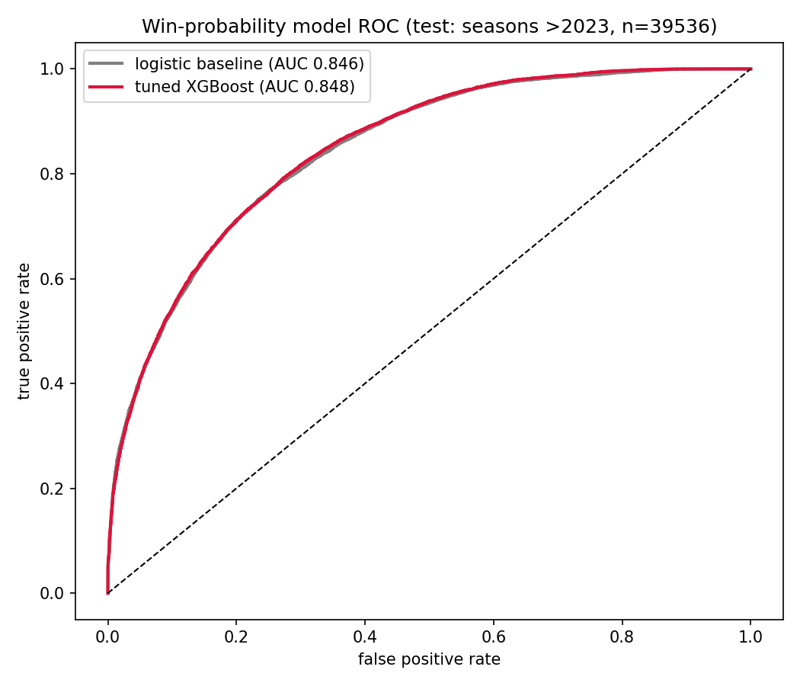
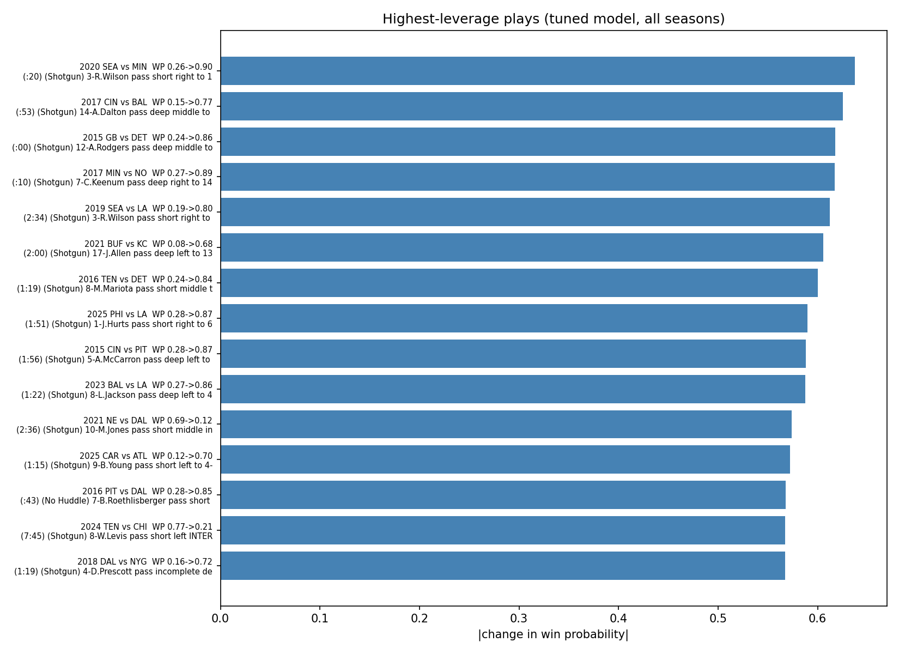

# nfl-win-probability

Win probability and high-leverage play analysis for the modern NFL era (2015-2025).

## What it does

1. **Data pipeline** (`src/nfl/data.py`): pulls standardized play-by-play for 2015-2025 via nfl-data-py (the Python port of nflfastR), caches raw files under `data/raw/`, and cleans them into a 221k-play modelling table with a win label per play.
2. **Models** (`src/nfl/train.py`): logistic baseline vs tuned XGBoost, trained on seasons <=2023 and evaluated on unseen 2024-25. Hyperparameters are selected on the 2023 validation season.
3. **Leverage analysis** (`src/nfl/leverage.py`): scores every play's pre- and post-play situation, ranks plays by how much they moved win probability, and charts the results.

## Results (v2)

Evaluated on unseen seasons 2024-25 (n=39,536 plays), from six hand-built situation features - score differential, down & distance, clock, field position, and the team ELO gap at game start (computed in-dataset, no external ratings feed):

| model | AUC |
|---|---|
| logistic baseline | 0.846 |
| tuned XGBoost (max_depth=4) | **0.848** |

The gap is modest on purpose - with only six features there isn't much left for a tree ensemble to find. The point of the repo is the reproducible pipeline, not a state-of-the-art number.



Highest-leverage plays found (|change in win probability|):

| season | matchup | play | WP before -> after |
|---|---|---|---|
| 2020 W5 | SEA vs MIN | Wilson short pass to Metcalf, 6 yds (:20 left) | 0.26 -> 0.90 |
| 2017 W17 | CIN vs BAL | Dalton deep pass to Boyd, 49 yds (:53 left) | 0.15 -> 0.78 |
| 2015 W13 | GB vs DET | Rodgers deep pass to Rodgers, 61 yds TD (:00 left) | 0.24 -> 0.86 |
| 2017 W19 | MIN vs NO | Keenum deep pass to Diggs, 61 yds TD (:10 left) | 0.27 -> 0.89 |
| 2019 W5 | SEA vs LA | Wilson short pass to Carson, 5 yds (2:34 left) | 0.19 -> 0.80 |



Interactive version - home-team win probability across every play of the highest-leverage games, with the decisive plays marked: [game_flow_interactive.html](output/game_flow_interactive.html) (opens in any browser).

## Two-tier configuration (why the repo is licensed GPLv3)

The code is fully public so you can verify it works, but not everything in it is meant to be copied:

- **`config/default.yaml`** — ships with the repo. The logistic baseline and its weights are completely reproducible from here.
- **`config/tuned.yaml`** — gitignored. The tuned XGBoost hyperparameters live here so a competitor can see the architecture without getting the magic numbers. Tuned config available on request.

The GPLv3 license means anyone who reuses this code commercially must open-source their derivative work. If that's not for you, ask before vendoring.

## Layout

```
config/         model configuration (default.yaml public, tuned.yaml local)
data/raw/       raw season downloads (gitignored, cached by the pipeline)
data/curated/   cleaned modelling table (committed: nfl_plays.parquet)
src/nfl/        package: data pipeline, features, models, training, leverage
tests/          unit tests — run with pytest
artifacts/      trained models (gitignored)
output/         generated charts
```

## Run it

```bash
python -m venv .venv
.venv\Scripts\pip install -r requirements.txt pytest   # Windows; use bin/pip on Linux/macOS
set PYTHONPATH=src                                      # Windows (or export PYTHONPATH=src)

# 1. fetch + clean (first run downloads ~11 seasons, a few minutes; cached after)
python -c "from nfl.data import *; save_curated(build_dataset(fetch_seasons(range(2015, 2026))))"

# 2. tune + train (writes config/tuned.yaml and artifacts/)
python -m nfl.train

# 3. leverage analysis + charts
python -m nfl.leverage

python -m pytest tests/
```

## Known simplifications (v2)

- Post-play situation for the leverage metric is still an approximation: score differential comes from the data, down & distance are advanced by the result, and the post-play clock is taken from the next play's actual remaining time (a 32 s decrement for a game's final play).
- Label = "did the team on offense win this game", which conflates in-possession performance with what happens later; a per-drive label would be cleaner but noisier.
- ELO ratings start at 1500 in 2015 and accumulate only from games inside this dataset, so early-era team gaps are compressed by construction.
- LightGBM crashed (access violation) on some Windows/Intel builds during development; XGBoost is used instead - same algorithm family, different binary.
